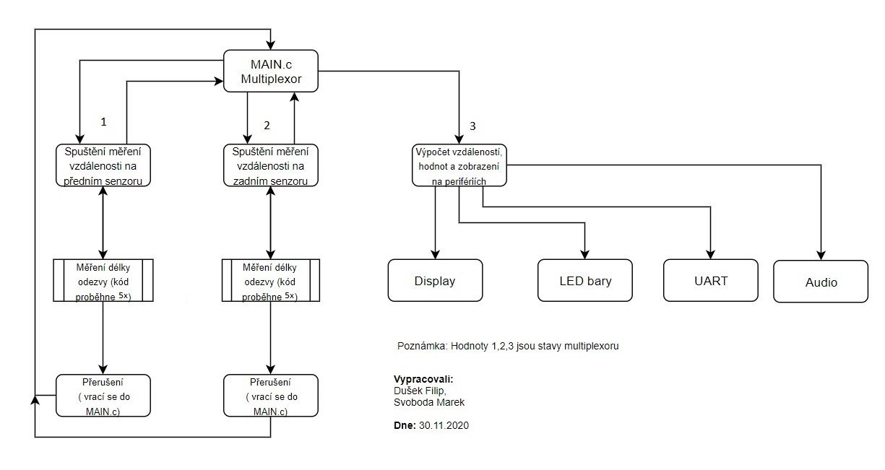
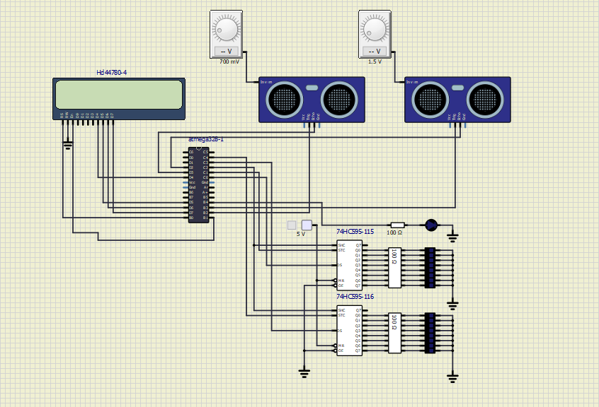
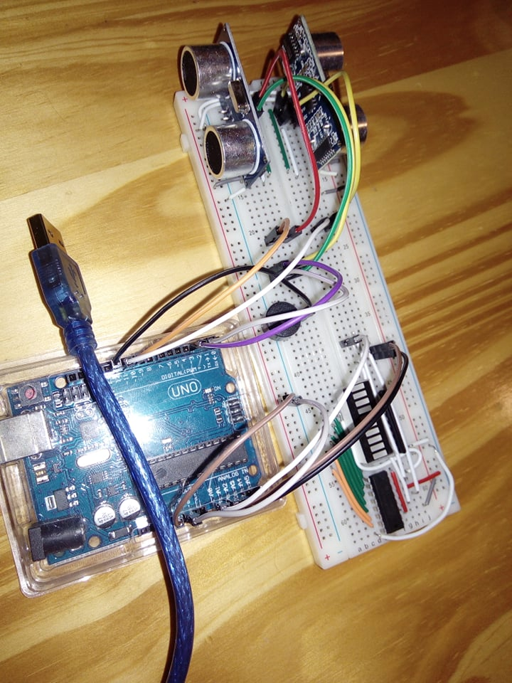

# Asistent pro parkování auta

| **Tým** | **Odkaz na github** |
| :-: | :-: |
| Dušek Filip | [Link to GitHub project folder](https://github.com/xdusek30/Digital-electronics-2/tree/master/Labs/project) |
| Marek Svoboda | [Link to GitHub project folder](https://github.com/xsvobo1q/Digital-electronics-2/tree/master/Labs/project) |

## Obsah

1. [Úvod](#Úvod)
2. [Hardware](#hardware)
3. [Software](#software)
5. [Vývojový diagram](#Vývojový_diagram)
4. [Popis kódu a simulace](#Popis_kódu_a_simulace)
5. [Dokumentace](#Dokumentace)
5. [Video](#Video)
6. [References](#References)

## Úvod

Tento projekt se zabívá realizací parkovacího asistenta pomocí dvou ultrazvukových parkovacích senzorů HC-SR04 a mikrokontroleru ATmega328P. Senzory HC-SR04 se nacházejí na přední a zadní straně auta, kde měří vzdálenosti od možné překážky. Pomocí dalších komponentů (displej, akustické signalizace a indikace vzdálenosti na LED panelu) je realizováno uživatelské rozhraní. 

## Hardware

- Arduino uno
- LCD diplay 16x2
- Ultrazvukové senzory  HC-SR04
- Signaliaze LED bary grafy
- Bzučák 5V 2,3kHz

## Software

- Atmel studio 7
- SimulIDE
- Doxygen

## Vývojový_diagram

## Popis_kódu_a_simulace

Kód pracuje jako multiplexor, který přepíná mezi meřením vzdálenosti od předního senzoru, zadního senzoru a zobrazováním hodnot. Byly využity dva čítače.
TIMER0 je využit na meření délky Echo pulsu a TIMER1 slouží k ovládání bzučáku, který "pípá" podle nejmenší vzdálenosti ze dvou měřených.

V první fázi je měřena vzdálenost překážky od předního senzoru. Podle doporučení výrobce je na Trigrovací vstup HC-SR04 vyslán spouštěcí impuls o určité délce a zároveň se zajistí,
aby se toto opakovalo nejdříve 50us po změření (opět doporučení výrobce). V tento okamžik mikrokontroler čeká na příchod Echo pulsu, jehož délka je závislá na vzdálenosti
překážky od senzoru. Tato funkce je realizována pomocí externího přerušení, které je nastavené na změnu úrovně na definovaném pinu mikrokontroléru. Senzor vyšle Echo puls s náběžnou hranou, která spustí
ISR. V ISR se povolí zápis do proměnné distanceFront. Zápis realizuje TIMER0 jehož každé přetečení znamená přičtení 16 us. Po příchodu sestupné hrany Echo pulsu se
zápis zakáže a hodnota distanceFront je připravena k dalšímu zpracování. Takový to cyklus proběhne pětkrát (průměrování hodnoty) a multiplexor se přepne na měření
vzdálenosti překážky od zadního senzoru. To probíhá naprosto stejně jako měření od předního senzoru. Nakonec multiplexor přepne na stav zobrazování, které si zavolá
funkci obsahující ovládání LCD displeje, LED bargrafů, UART a bzučáku. Součástí této funkce je samozřejmě výpočet vzdálenosti podle načítaných hodnot. Přesnost 16 us odpovídá
přesnosti cca 2,7mm.

Zobrazovací funkce vyhodnotí menší z měřených vzdáleností a podle této hodnoty ovládá rychlost přetečení (vrací inicializační hodnotu registru TCNT1) čítače TIMER1, což způsobí
změnu rychlosti pípání bzučáku.
Poté pro každou ze vzdáleností vyhodnotí počet rozsvícených signalizačních diod a hodnoty vypíše na UART a LCD displej s přesností na jedno desetinné místo. S větší přesností nemá smysl vypisovat, protože senzor sám o sobě má přesnost kolem 2 mm.

#### Zapojení v SimulIDE

Pozn.: V SimulIDE je realizován audio výstup pomocí LED diody, jelikož zde audio výstup není funkční.

#### Reálné zapojení

Pozn.: Kvůli nefunkčnímu dipleji a nedostatečnému množství součástek je reálné zapojení ve videu demonstrováno zvukem z bzučáku a signaliazce předního senzoru.

## Dokumentace
**Odkaz na dokumntaci**
- [Dokumentace](pdf_documentation.pdf)

## Video
**Poznámky pro video:**
- Ve videu si nechází simulace v SimulIDE a simulace reálného zapojení.
- Kvůli nefunkčnímu dipleji a nedostatečnému množství součástek je reálné zapojení ve videu demonstrováno zvukem z bzučáku a signaliazce předního senzoru.

**Odkaz na video**

[Odkaz na video](https://youtu.be/WLFjbmJf0p0)

## References

1. https://ww1.microchip.com/downloads/en/DeviceDoc/ATmega48A-PA-88A-PA-168A-PA-328-P-DS-DS40002061B.pdf
2. https://howtomechatronics.com/tutorials/arduino/ultrasonic-sensor-hc-sr04/

